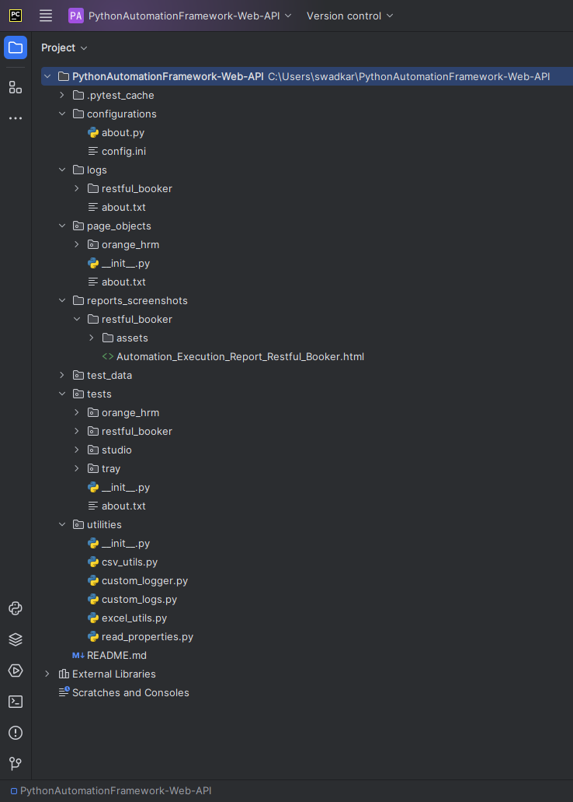

## PythonAutomationFramework-Web-API - Python (Selenium,Requests)

- Python
- PyTest
- Selenium
- Requests
- HTML Report
- (POM) Page Object Model
- Run tests parallely with xdist

### Folder Structure

- Command to run regression test suite for restful booker : 

pytest -v -s -m regression --html=reports_screenshots/restful_booker/Automation_Execution_Report_Restful_Booker.html tests/restful_booker

 **Author Name - Saish Wadkar**
